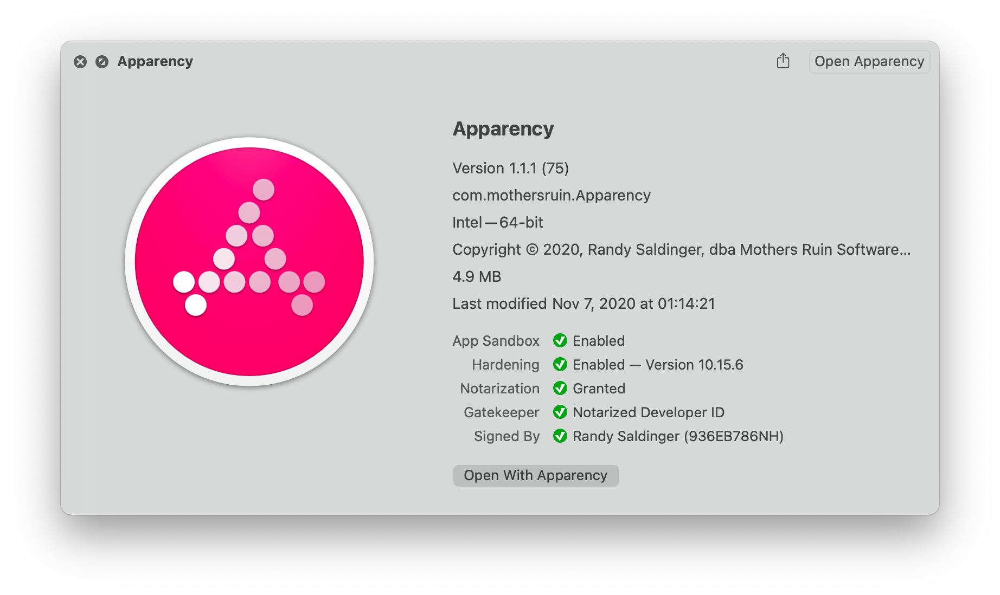
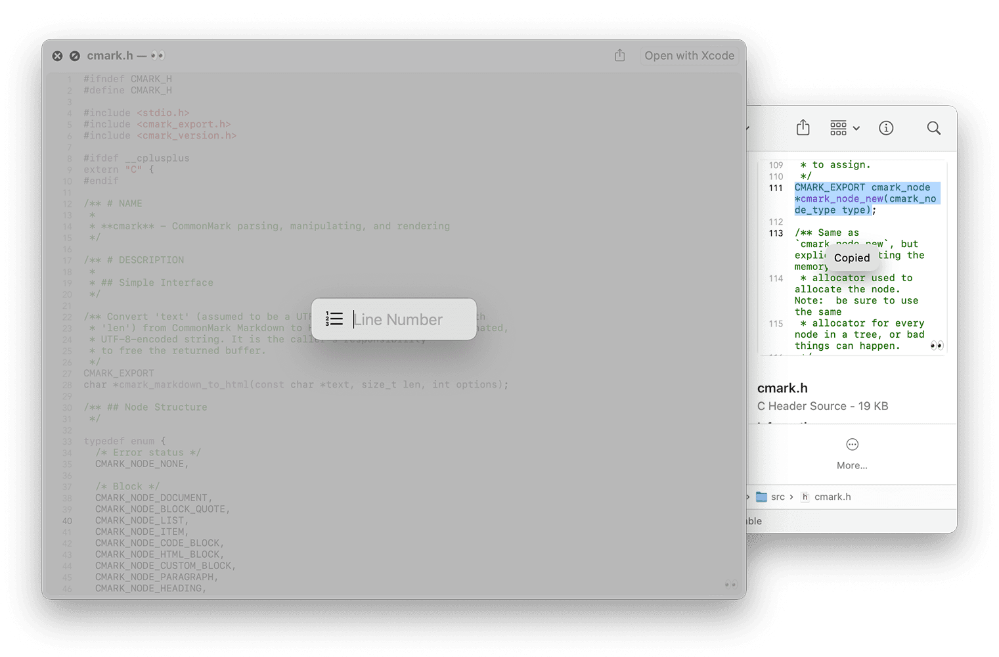
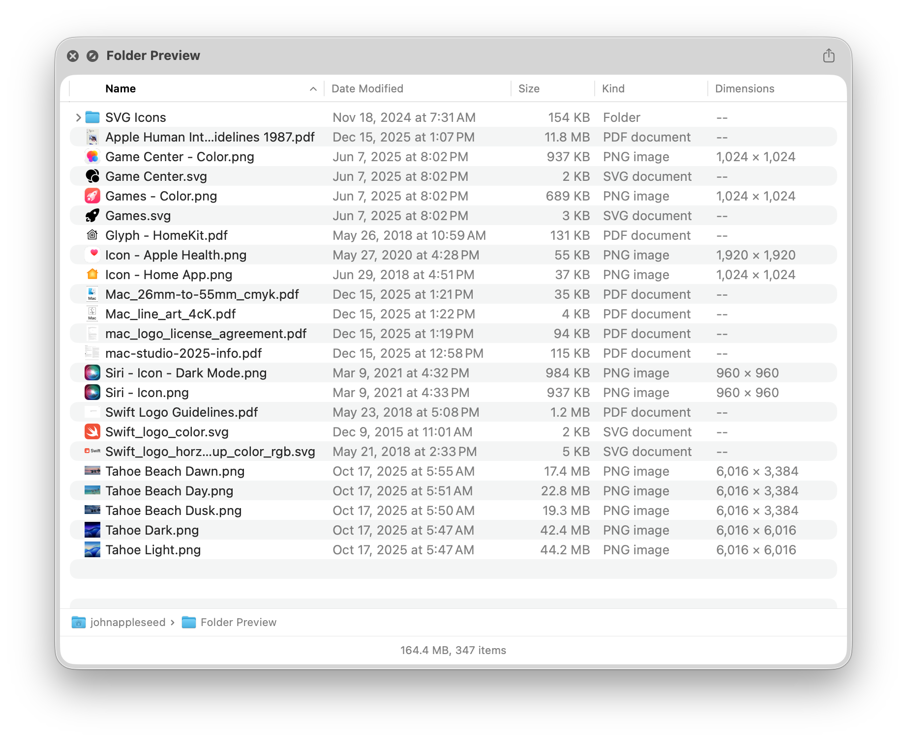
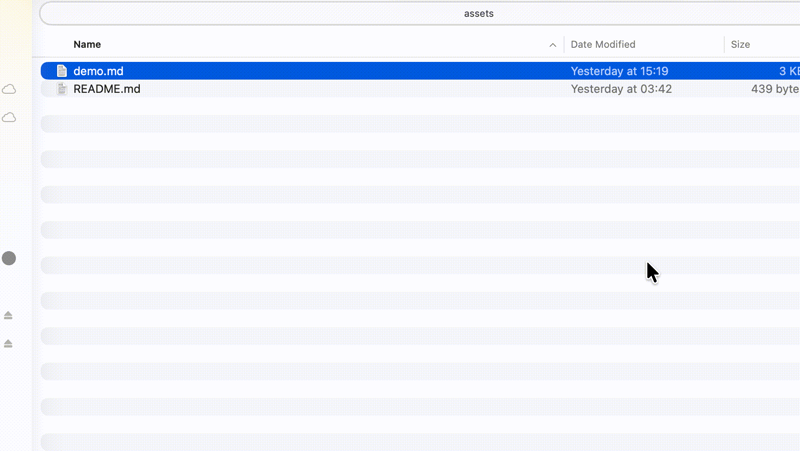
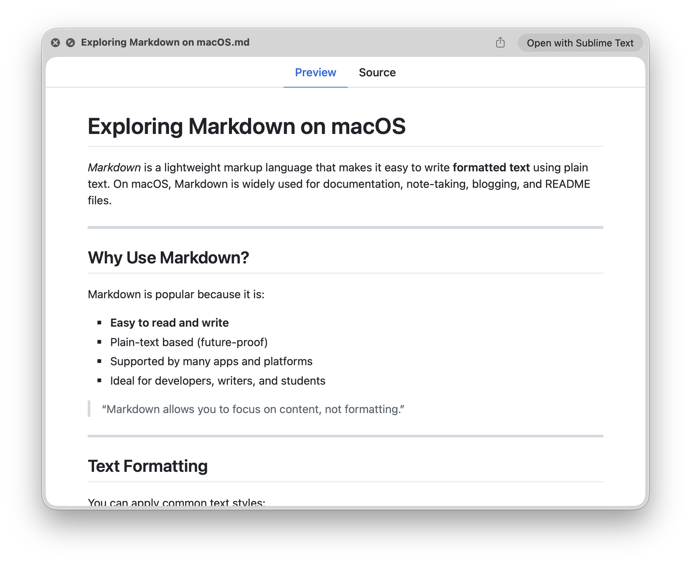
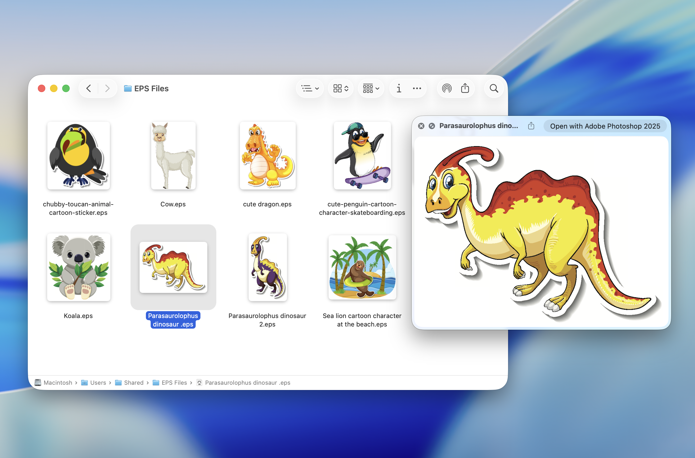

# Quick Look plugins [](https://awesome.re)

> List of useful [Quick Look](https://en.wikipedia.org/wiki/Quick_Look) plugins for developers

## Install

### Using [Homebrew](https://brew.sh)

- Run `brew install <package>`

##### Catalina notes

To get many plugins working in Catalina and later, you will need to remove the quarantine attribute.

Run this to see the attributes:

```
xattr -r ~/Library/QuickLook
```

And run this to remove the attributes:

```
xattr -d -r com.apple.quarantine ~/Library/QuickLook
```

### Manually

- Click "download manually"
- Move the downloaded .qlgenerator file to `~/Library/QuickLook`
- Run `qlmanage -r`

## Plugins

### [QLStephen](https://github.com/whomwah/qlstephen)

> Preview plain text files without or with unknown file extension. Example: README, CHANGELOG, index.styl, etc.

Run `brew install qlstephen` or [download manually](https://github.com/whomwah/qlstephen/releases/latest)

[](https://github.com/whomwah/qlstephen)

### [QLMarkdown](https://github.com/sbarex/QLMarkdown)

> Preview Markdown files

Run `brew install --cask qlmarkdown` or [download manually](https://github.com/sbarex/QLMarkdown/releases/latest)

[](https://github.com/sbarex/QLMarkdown)

### [QuickLookJSON](http://www.sagtau.com/quicklookjson.html)

> Preview JSON files

[Download manually](http://www.sagtau.com/media/QuickLookJSON.qlgenerator.zip)

[](http://www.sagtau.com/quicklookjson.html)

### [BetterZipQL](https://macitbetter.com/downloads/)

> Preview archives

> Note: The BetterZipQL plugin was integrated with the BetterZip app.

Run `brew install betterzip` to install the BetterZip app and its Quick Look plugin or [download manually](https://macitbetter.com/BetterZip.zip)

The legacy BetterZipQL plugin can be [downloaded here](https://macitbetter.com/dl/BetterZipQL-1.5.zip).

[](https://macitbetter.com/BetterZip-Quick-Look-Generator/)

### [Suspicious Package](https://www.mothersruin.com/software/SuspiciousPackage/)

> Preview the contents of a standard Apple installer package

Run `brew install suspicious-package` or [download manually](https://www.mothersruin.com/software/downloads/SuspiciousPackage.xip)

[](https://www.mothersruin.com/software/SuspiciousPackage/)

### [Apparency](https://www.mothersruin.com/software/Apparency/)

> Preview the contents of a macOS app

Run `brew install apparency` or [download manually](https://mothersruin.com/software/downloads/Apparency.dmg)

[](https://mothersruin.com/software/Apparency/)

### [QLVideo](https://github.com/Marginal/QLVideo)

> Preview most types of video files, as well as their thumbnails, cover art and metadata

Run `brew install qlvideo` or [download manually](https://github.com/Marginal/QLVideo/releases/latest)

[](https://github.com/Marginal/QLVideo)

### [Peek](https://bigzlabs.com/peek) 💰

> Peek allows you to copy and find text, jump to line numbers, render Github-flavored Markdown with a generated table of contents, restore scroll positions, highlight syntax, & more in the Quick Look previews of over 300 file extensions.

Purchase on the [App Store](https://apps.apple.com/app/peek-quick-look-extension/id1554235898).

*The app is abandoned and buggy, but still functional.*

[](https://bigzlabs.com/peek)

### [Folder Preview](https://anybox.ltd/folder-preview) 💰

> Quick look inside folders and archives.

Purchase on the [App Store](https://apps.apple.com/app/folder-preview/id6698876601).

[](https://anybox.ltd/folder-preview)

### [FluxMarkdown](https://github.com/xykong/flux-markdown)

> Preview Markdown files with Mermaid diagrams, KaTeX math, GFM support, and interactive table of contents.

Run `brew tap xykong/tap && brew install --cask flux-markdown` or [download manually](https://github.com/xykong/flux-markdown/releases/latest)

[](https://github.com/xykong/flux-markdown)

### [Markdown Preview](https://anybox.ltd/markdown-preview) 💰

> Quick look Markdown files with KaTex and Mermaid support.

Purchase on the [App Store](https://apps.apple.com/app/markdown-preview-quick-look/id6739955340).

[](https://anybox.ltd/markdown-preview)

### [EPS Preview](https://anybox.ltd/eps-preview) 💰

> EPS Preview adds Quick Look and thumbnails of EPS files to Finder.

Purchase on the [website](https://anybox.ltd/eps-preview).

[](https://anybox.ltd/eps-preview)

### [ProvisionQL](https://github.com/ealeksandrov/ProvisionQL)

> Preview iOS / macOS app and provision information

Run `brew install provisionql` or [download manually](https://github.com/ealeksandrov/ProvisionQL/releases/latest)

[](https://github.com/ealeksandrov/ProvisionQL)

### [WebP](https://github.com/dchest/webp-quicklook)

> Preview WebP images

> NOTE: This is already covered by `qlImageSize`, so this plugin is listed here only in case you do not like `qlImageSize`.

Run `brew install webpquicklook` or [download manually](https://github.com/dchest/webp-quicklook/releases/latest)

[](https://github.com/dchest/webp-quicklook)

### [SourceCodeSyntaxHighlight](https://github.com/sbarex/SourceCodeSyntaxHighlight)

> Preview many different source code files

Run `brew install --cask --no-quarantine syntax-highlight` or [download manually](https://github.com/sbarex/SourceCodeSyntaxHighlight/releases/latest)

[](https://github.com/sbarex/SourceCodeSyntaxHighlight)

**Note:** This might overwrite some other Quick Look plugins.

## License

[](https://creativecommons.org/publicdomain/zero/1.0/)

To the extent possible under law, [Sindre Sorhus](https://sindresorhus.com) has waived all copyright and related or neighboring rights to this work.
