# Quick Look plugins [](https://awesome.re)

> List of useful [Quick Look](http://en.wikipedia.org/wiki/Quick_Look) plugins for developers


## Install

### Using [Homebrew Cask](https://github.com/phinze/homebrew-cask)

- Run `brew cask install <package>`

#### Install all

```
brew cask install qlcolorcode qlstephen qlmarkdown quicklook-json qlimagesize webpquicklook suspicious-package quicklookase qlvideo
```

### Manually

- Click "download manually"
- Move the downloaded .qlgenerator file to `~/Library/QuickLook`
- Run `qlmanage -r`


## Plugins


### [QLColorCode](https://github.com/anthonygelibert/QLColorCode)

> Preview source code files with syntax highlighting

Run `brew cask install qlcolorcode` or [download manually](https://github.com/anthonygelibert/QLColorCode/releases/latest)

[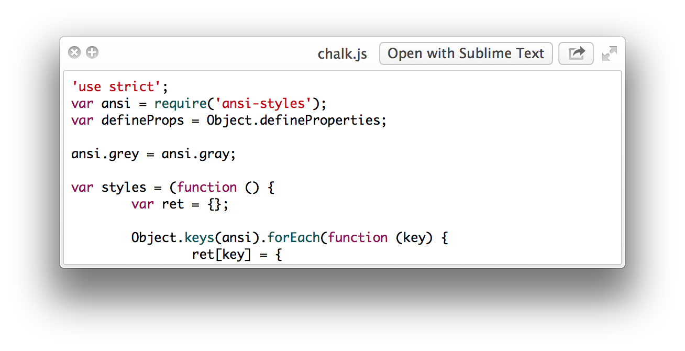](https://github.com/anthonygelibert/QLColorCode)


### [QLStephen](https://github.com/whomwah/qlstephen)

> Preview plain text files without or with unknown file extension. Example: README, CHANGELOG, index.styl, etc.

Run `brew cask install qlstephen` or [download manually](https://github.com/whomwah/qlstephen/releases/latest)

[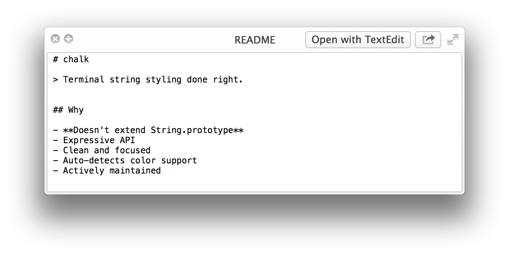](https://github.com/whomwah/qlstephen)


### [QLMarkdown](https://github.com/toland/qlmarkdown)

> Preview Markdown files

Run `brew cask install qlmarkdown` or [download manually](https://github.com/downloads/toland/qlmarkdown/QLMarkdown-1.3.zip)

[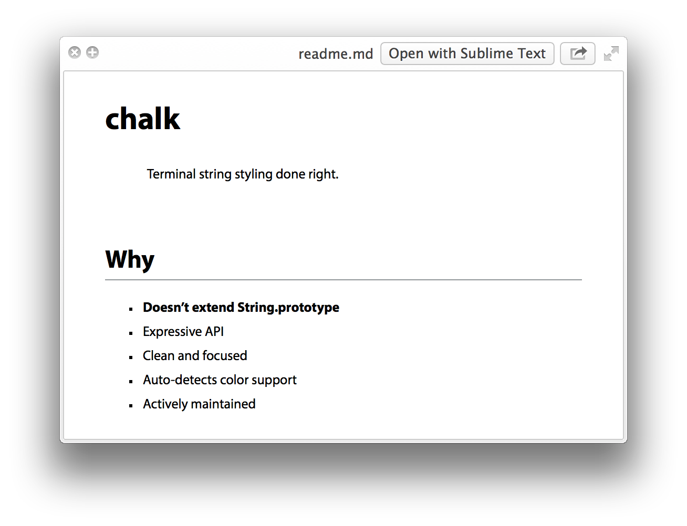](https://github.com/toland/qlmarkdown)


### [QuickLookJSON](http://www.sagtau.com/quicklookjson.html)

> Preview JSON files

Run `brew cask install quicklook-json` or [download manually](http://www.sagtau.com/media/QuickLookJSON.qlgenerator.zip)

[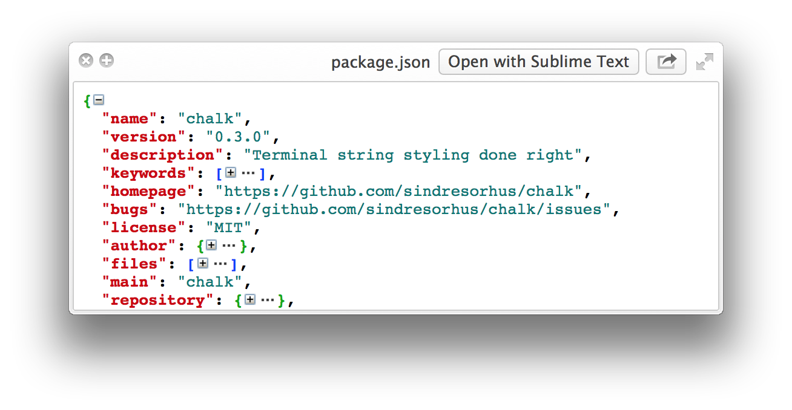](http://www.sagtau.com/quicklookjson.html)


### [BetterZipQL](https://macitbetter.com/downloads/)

> Preview archives

> Note: The BetterZipQL plugin was integrated with the BetterZip app.

Run `brew cask install betterzip` to install the BetterZip app and its Quick Look plugin or [download manually](https://macitbetter.com/BetterZip.zip)

The legacy BetterZipQL plugin can be [downloaded here](https://macitbetter.com/dl/BetterZipQL-1.5.zip).

[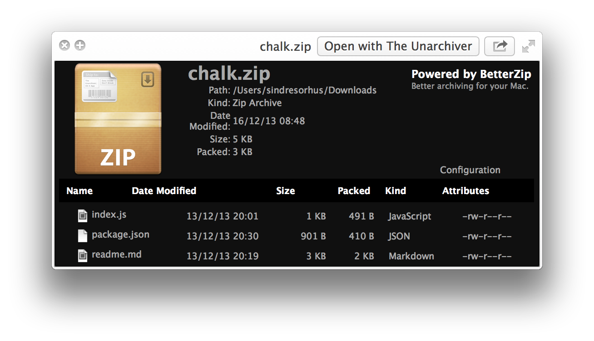](http://macitbetter.com/BetterZip-Quick-Look-Generator/)


### [qlImageSize](https://github.com/Nyx0uf/qlImageSize)

> Display image size and resolution

Run `brew cask install qlimagesize` or [download manually](https://github.com/Nyx0uf/qlImageSize#installation)

[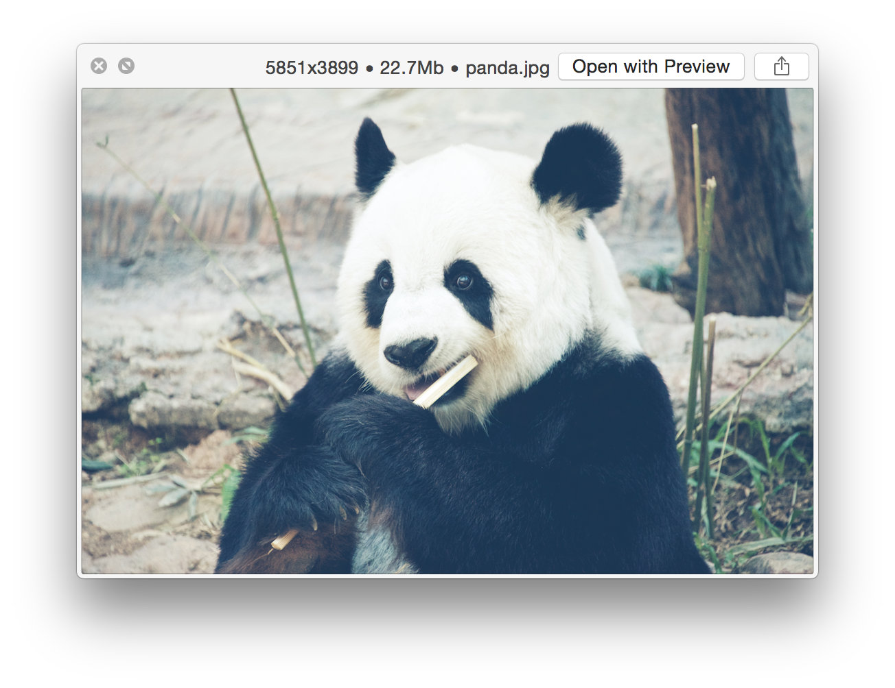](https://github.com/Nyx0uf/qlImageSize)


### [WebP](https://github.com/dchest/webp-quicklook)

> Preview WebP images

Run `brew cask install webpquicklook` or [download manually](https://github.com/dchest/webp-quicklook/releases/latest)

[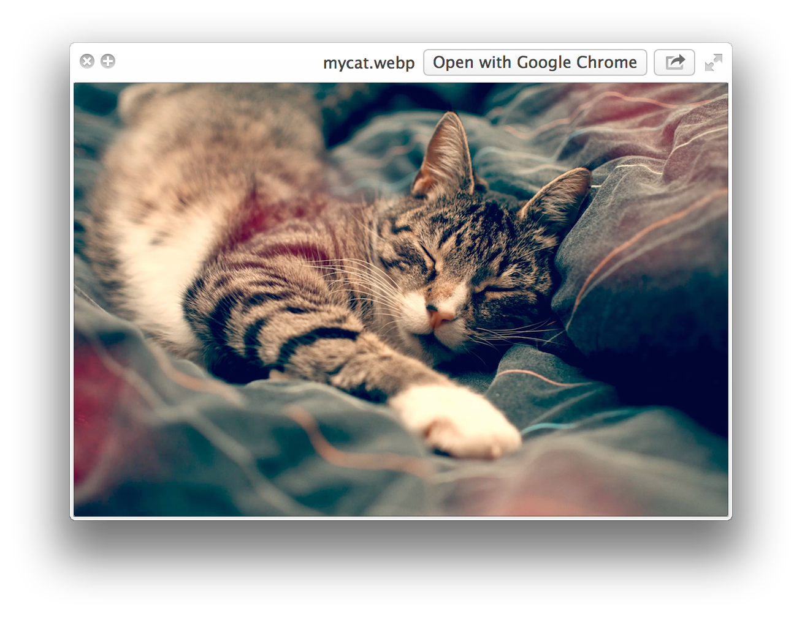](https://github.com/dchest/webp-quicklook)


### [Suspicious Package](http://www.mothersruin.com/software/SuspiciousPackage/)

> Preview the contents of a standard Apple installer package

Run `brew cask install suspicious-package` or [download manually](http://www.mothersruin.com/software/downloads/SuspiciousPackage.xip)

[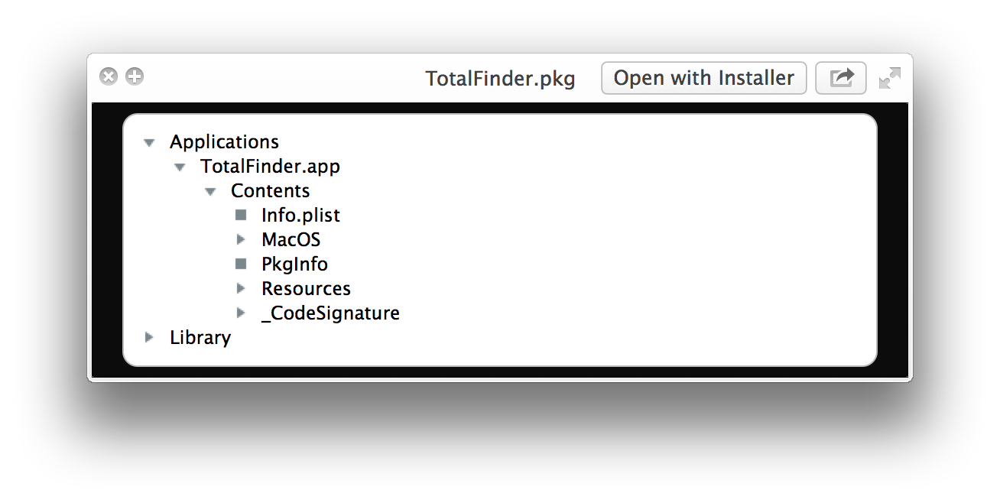](http://www.mothersruin.com/software/SuspiciousPackage/)


### [QuickLookASE](https://github.com/rsodre/QuickLookASE)

> Preview Adobe ASE Color Swatches generated with Adobe Photoshop, Adobe Illustrator, [Adobe Color CC](https://color.adobe.com), [Spectrum](http://www.eigenlogik.com/spectrum/mac), [COLOURlovers](http://www.colourlovers.com), [Prisma](http://www.codeadventure.com), among many others.

Run `brew cask install quicklookase` or [download manually](https://github.com/rsodre/QuickLookASE/releases/latest)

[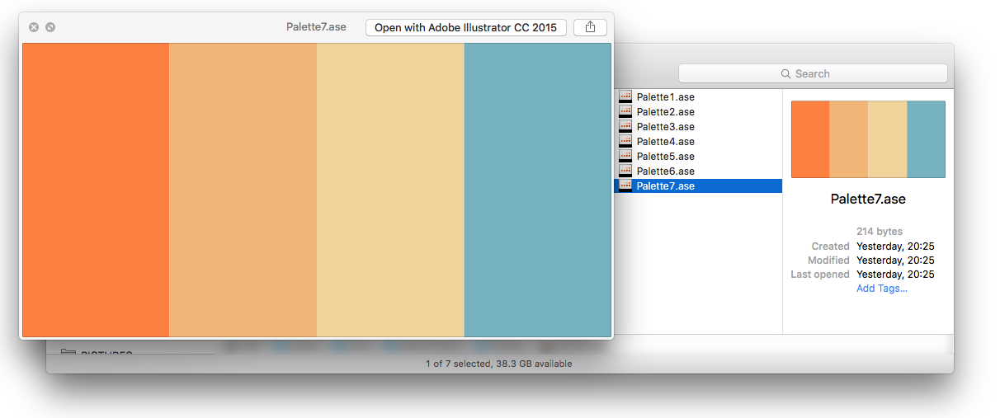](https://github.com/rsodre/QuickLookASE)


### [QLVideo](https://github.com/Marginal/QLVideo)

> Preview most types of video files, as well as their thumbnails, cover art and metadata

Run `brew cask install qlvideo` or [download manually](https://github.com/Marginal/QLVideo/releases/latest)

[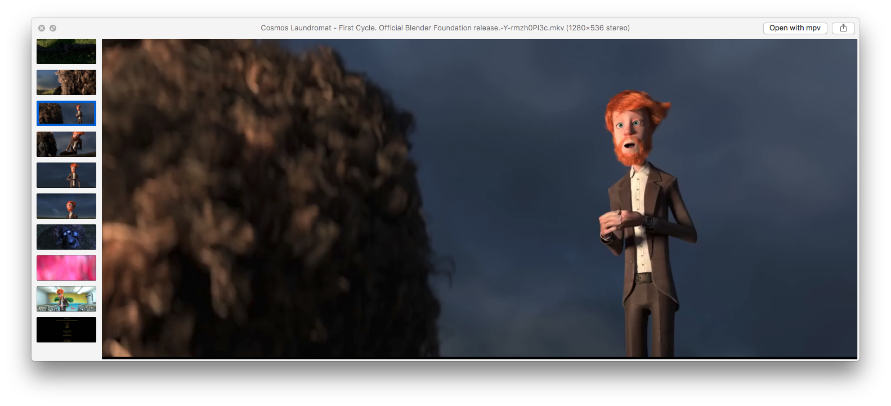](https://github.com/Marginal/QLVideo)


### [QLMobi](https://github.com/bfabiszewski/QLMobi)

> Preview various ebook formats used on Kindle readers (prc, mobi, azw, azw3, azw4 and some pdb files)

Run `brew cask install qlmobi` or [download manually](https://github.com/bfabiszewski/QLMobi/releases/latest)

[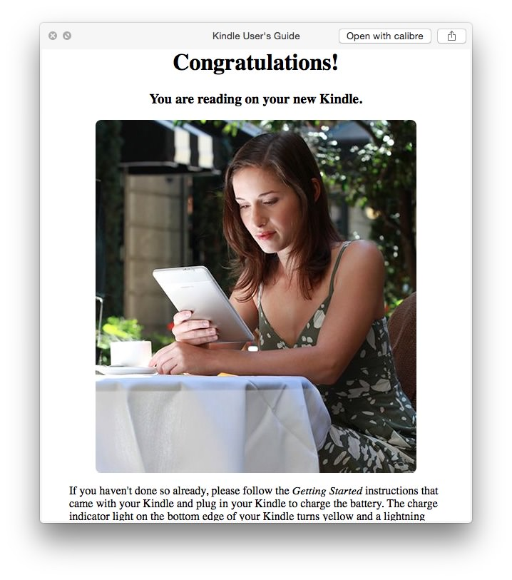](https://github.com/bfabiszewski/QLMobi)


## More

*These are not included in [Install all](#install-all).*

### [ProvisionQL](https://github.com/ealeksandrov/ProvisionQL)

> Preview iOS / macOS app and provision information

Run `brew cask install provisionql` or [download manually](https://github.com/ealeksandrov/ProvisionQL/releases/latest)

[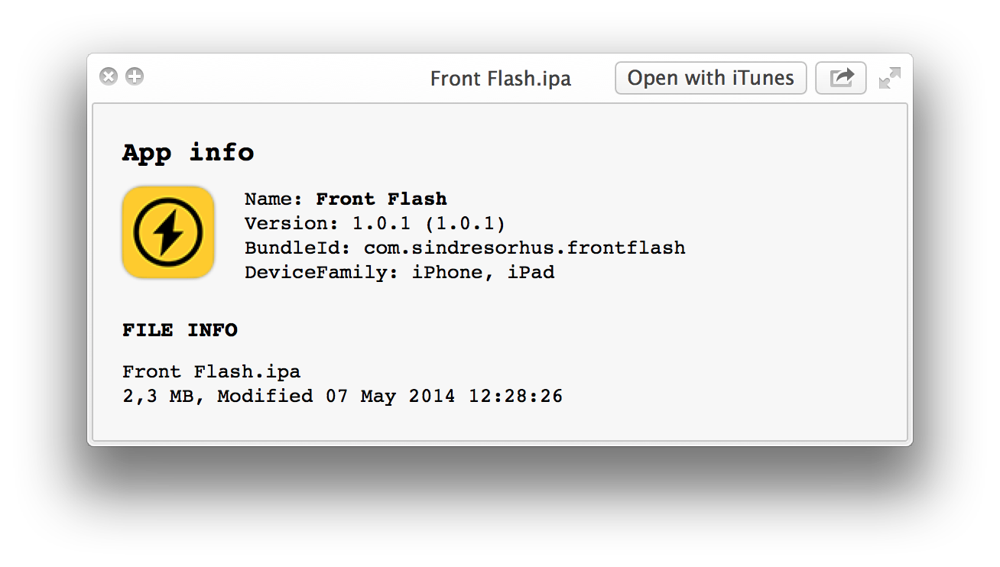](https://github.com/ealeksandrov/ProvisionQL)


### [QuickLookAPK](https://github.com/hezi/QuickLookAPK)

> Preview Android APK files

Run `brew cask install quicklookapk` or [download manually](https://github.com/hezi/QuickLookAPK/blob/master/QuickLookAPK.qlgenerator.zip)

[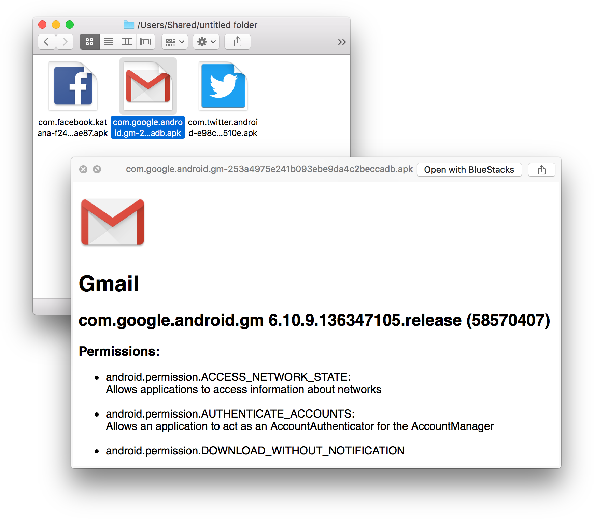](https://github.com/hezi/QuickLookAPK)


### [quicklook-pat](https://github.com/pixelrowdies/quicklook-pat)

> Preview Adobe Photoshop pattern files

Run `brew cask install quicklook-pat` or [download manually](https://github.com/pixelrowdies/quicklook-pat/releases)

[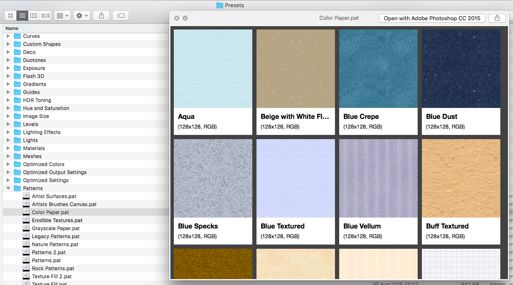](https://github.com/pixelrowdies/quicklook-pat)


## License

[](https://creativecommons.org/publicdomain/zero/1.0/)

To the extent possible under law, [Sindre Sorhus](http://sindresorhus.com) has waived all copyright and related or neighboring rights to this work.
