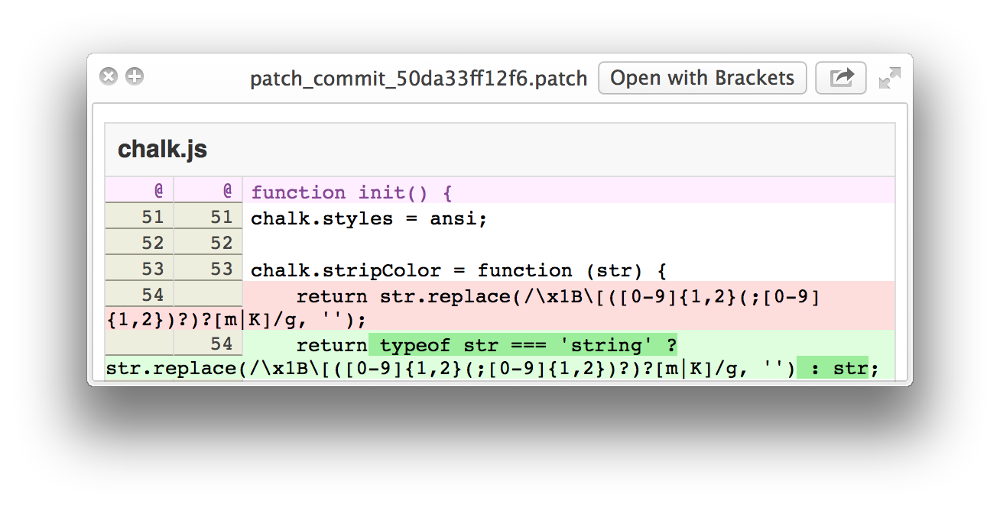
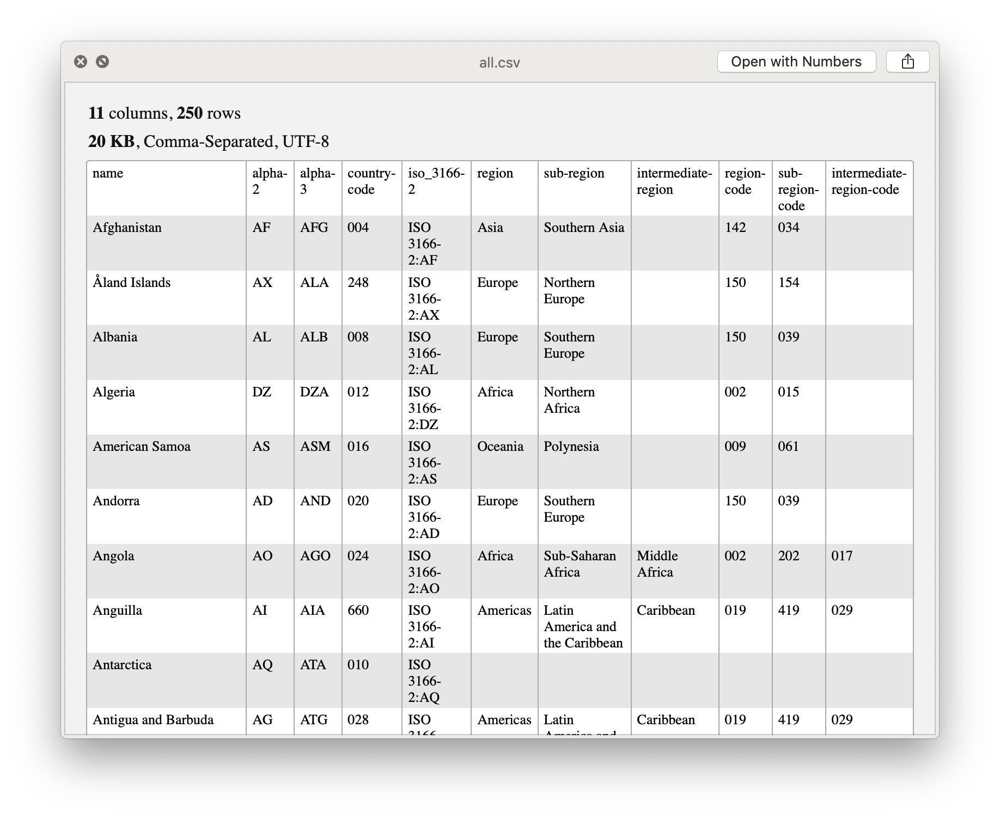

# Quick Look plugins

> List of useful [Quick Look](http://en.wikipedia.org/wiki/Quick_Look) plugins for developers


## Install

### Using [Homebrew Cask](https://github.com/phinze/homebrew-cask)

- Run `brew cask install <package>`

#### Install all

```
brew cask install qlcolorcode qlstephen qlmarkdown quicklook-json qlprettypatch quicklook-csv betterzipql webpquicklook suspicious-package
```

### Manually

- Click "download manually"
- Move the downloaded .qlgenerator file to /Library/QuickLook
- Run `qlmanage -r`


## Plugins


### [QLColorCode](https://code.google.com/p/qlcolorcode/)

> Preview source code files with syntax highlighting

Run `brew cask install qlcolorcode` or [download manually](https://qlcolorcode.googlecode.com/files/QLColorCode-2.0.2.tgz)

[](https://code.google.com/p/qlcolorcode/)


### [QLStephen](https://github.com/whomwah/qlstephen)

> Preview plain text files without a file extension. Example: README, CHANGELOG, etc.

Run `brew cask install qlstephen` or [download manually](https://github.com/whomwah/qlstephen/releases)

[](https://github.com/whomwah/qlstephen)


### [QLMarkdown](https://github.com/toland/qlmarkdown)

> Preview Markdown files

Run `brew cask install qlmarkdown` or [download manually](https://github.com/downloads/toland/qlmarkdown/QLMarkdown-1.3.zip)

[](https://github.com/toland/qlmarkdown)


### [QuickLookJSON](http://www.sagtau.com/quicklookjson.html)

> Preview JSON files

Run `brew cask install quicklook-json` or [download manually](http://www.sagtau.com/media/QuickLookJSON.qlgenerator.zip)

[](http://www.sagtau.com/quicklookjson.html)


### [QLPrettyPatch](https://github.com/atnan/QLPrettyPatch)

> Preview .patch files

Run `brew cask install qlprettypatch` or [download manually](https://github.com/atnan/QLPrettyPatch/releases)

[](https://github.com/atnan/QLPrettyPatch)


### [QuickLookCSV](https://github.com/p2/quicklook-csv)

> Preview CSV files

Run `brew cask install quicklook-csv` or [download manually](http://quicklook-csv.googlecode.com/files/QuickLookCSV.dmg)

[](https://github.com/p2/quicklook-csv)


### [BetterZipQL](http://macitbetter.com/BetterZip-Quick-Look-Generator/)

> Preview archives

Run `brew cask install betterzipql` or [download manually](http://macitbetter.com/BetterZipQL.zip)

[](http://macitbetter.com/BetterZip-Quick-Look-Generator/)


### [WebP](https://github.com/dchest/webp-quicklook)

> Preview WebP images

Run `brew cask install webpquicklook` or [download manually](https://github.com/dchest/webp-quicklook/releases)

[](https://github.com/dchest/webp-quicklook)


### [Suspicious Package](http://www.mothersruin.com/software/SuspiciousPackage/)

> Preview the contents of a standard Apple installer package

Run `brew cask install suspicious-package` or [download manually](http://www.mothersruin.com/software/downloads/SuspiciousPackage.dmg)

[](http://www.mothersruin.com/software/SuspiciousPackage/)


## More

*These are not included in [Install all](#install-all).*

### [ProvisionQL](https://github.com/ealeksandrov/ProvisionQL)

> Preview iOS / OS X app and provision information

Run `brew cask install provisionql` or [download manually](https://github.com/ealeksandrov/ProvisionQL/releases)

[](https://github.com/ealeksandrov/ProvisionQL)

### Other

- [CertQuickLook](https://code.google.com/p/cert-quicklook/) - preview various unprotected certificate tokens like X509 certificates, DER or PEM


## Tip

Run this in your terminal to allow text selection in the Quick Look window:

```
defaults write com.apple.finder QLEnableTextSelection -bool true && killall Finder
```


## License

[](http://creativecommons.org/publicdomain/zero/1.0/)

To the extent possible under law, [Sindre Sorhus](http://sindresorhus.com) has waived all copyright and related or neighboring rights to this work.
